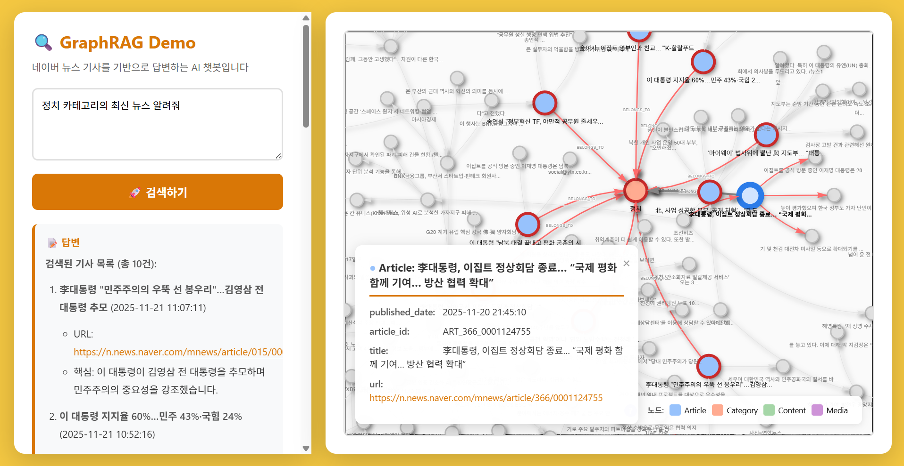

# GraphRAG 실시간 시각화 데모

```
┌─────────────────┐
│   Frontend      │
│   (HTML + JS)   │  ← vis-network.js를 사용한 그래프 시각화
└────────┬────────┘
         │
    HTTP API
         │
┌────────▼────────┐
│   FastAPI       │
│   Backend       │
└────────┬────────┘
         │
┌────────▼────────┐
│   GraphRAG      │  ← ToolsRetriever (Vector + VectorCypher + Text2Cypher)
└────────┬────────┘
         │
┌────────▼────────┐
│   Neo4j DB      │  ← Knowledge Graph 저장소
└─────────────────┘
```

## 설치 및 실행

### 0. Neo4j Database
   - Neo4j 실행 중이어야 함 (기본: `neo4j://localhost:7687`)
   - 뉴스 기사 데이터가 이미 그래프로 구축되어 있어야 함
   - 필요한 벡터 인덱스: `content_vector_index`

### 1. 환경 설정

```bash
uv venv
uv pip install -r requirements.txt

cp .env.example .env
```

### 2. 서버 실행

```bash
python app.py
```

또는

```bash
uvicorn app:app --host 0.0.0.0 --port 8000 --reload
```

### 3. 브라우저에서 접속

```
http://localhost:8000
```

## 사용 방법

1. **그래프 로딩**: 페이지가 로드되면 자동으로 전체 Knowledge Graph가 표시됩니다

2. **질문 입력**: 좌측 패널에서 질문을 입력하거나 예시 질문을 클릭합니다

3. **검색 실행**: "🚀 검색하기" 버튼을 클릭합니다

4. **결과 확인**:
   - 좌측: LLM이 생성한 답변과 메타데이터
   - 우측: 해당 질문에 사용된 노드들이 빨간색으로 하이라이트

### 데모 실행 예시


